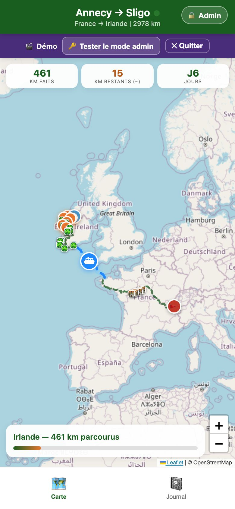
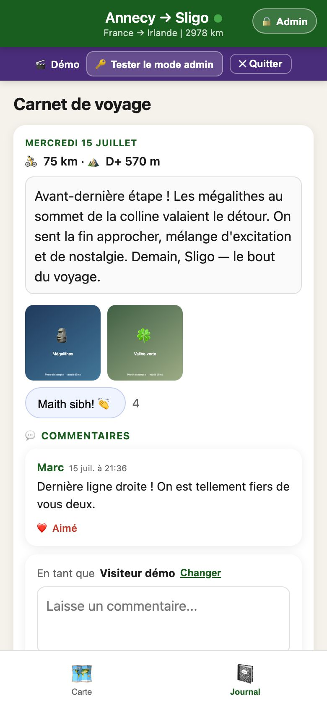
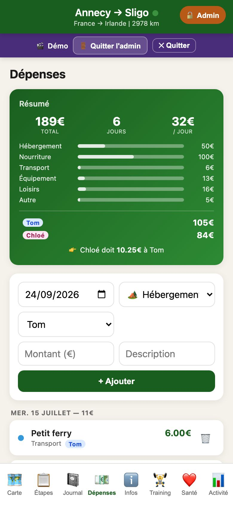
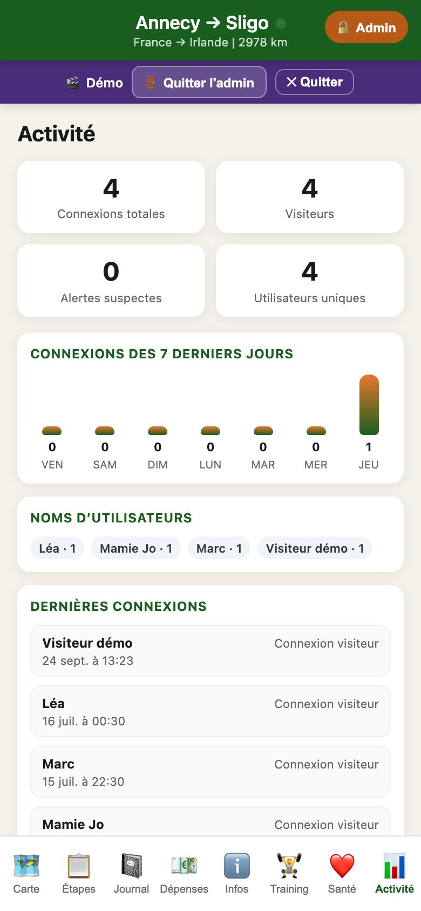
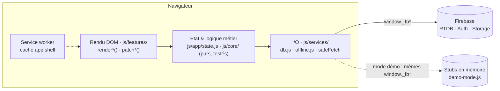

# biketrip — Annecy → Sligo à vélo

[](https://github.com/tomcavaliere/France-Irlande/actions/workflows/ci.yml)

PWA de carnet de voyage que j'ai conçue et développée pour un voyage à vélo de ~2 980 km
(Annecy → Roscoff, ferry, Cork → Sligo) au printemps 2026. Pendant le voyage, je publiais
chaque soir position, étape, récit et photos ; nos proches suivaient en direct et
commentaient. Le voyage est terminé : la vraie version est archivée en lecture seule.

### 👉 [Essayer la démo](https://tomcavaliere.github.io/France-Irlande/#demo)

Données 100 % fictives (6 étapes irlandaises sur le vrai tracé), aucune connexion au
backend. Le bouton **« Tester le mode admin »** ouvre tout l'espace d'administration sans
mot de passe. Les modifications sont conservées jusqu'au rechargement de la page. La démo
fonctionne aussi hors-ligne une fois chargée.

| Carte | Carnet | Dépenses (admin) | Activité (admin) |
|---|---|---|---|
|  |  |  |  |

## Fonctionnalités

**Visiteurs** : carte Leaflet du tracé complet avec les traces GPX réelles, progression en
kilomètres, carnet de voyage (récit, photos, vidéos), commentaires et « bravos ». Depuis
l'archivage, la vraie version est en lecture seule : plus de formulaire de commentaire, les
bravos restent affichés en compteur (la démo garde toutes les interactions).

**Admin** (Firebase Auth, déconnexion automatique après 3 min d'inactivité) :
- mise à jour de la position GPS, création d'étapes, import de traces GPX
- rédaction du journal avec brouillon/publication
- upload de photos compressées et de vidéos (Firebase Storage)
- réponses aux commentaires, dépenses partagées avec calcul de l'équilibre
- campings et points d'eau le long du tracé, météo à la position
- tableau de bord des connexions

**Hors-ligne** : app shell servi par un service worker, dernier état en cache local.
Les écritures du journal, des commentaires et des dépenses sont mises en file
(localStorage) et synchronisées au retour du réseau.

## Architecture

HTML/CSS/JavaScript vanilla, **sans framework ni build** : une trentaine de scripts
chargés dans l'ordre, servis tels quels par GitHub Pages.



- **Trois couches strictes.** Le rendu ne touche jamais Firebase, la logique ne touche
  jamais le DOM. Toute la logique non triviale vit dans des modules purs rangés dans `js/core/` (GPS,
  validation, statistiques, fusion des brouillons…), chargés tels quels par le navigateur
  et par les tests. La production exécute donc exactement le code testé.
- **Une seule façade I/O.** `js/services/db.js` expose `Db.get/set/remove/on` au-dessus des globales
  `window._fb*`. En mode démo, `js/demo/demo-mode.js` remplace ces globales par des stubs en
  mémoire : aucun site d'appel ne change et aucune requête ne part vers Firebase, ce que
  vérifient les tests E2E.
- **Bus d'événements.** Les mutations d'état émettent des événements, et `js/app/init.js`
  centralise la politique de re-rendu.
- **Sécurité.**
  - CSP stricte, sans script inline ; Leaflet est auto-hébergé.
  - Échappement systématique des contenus utilisateur.
  - Règles Firebase versionnées (`firebase/`) et vérifiées en CI : lecture seule
    publique, aucune écriture anonyme depuis l'archivage.
  - Un script de contrôle interdit `eval`, `document.write` et tout `fetch()` direct.
- **Confidentialité (RGPD).** Page [Confidentialité et mentions légales](https://tomcavaliere.github.io/France-Irlande/confidentialite.html),
  accessible depuis chaque onglet. Aucun cookie ni mesure d'audience, collecte minimale :
  plus aucun suivi depuis l'archivage, identifiant visiteur créé seulement lors d'une
  écriture, aucun appel tiers superflu (la météo n'est chargée que pour l'admin), point de
  départ du tracé masqué. Registre des traitements et audit dans [`docs/rgpd.md`](docs/rgpd.md).

### Choix et compromis

| Choix | Pourquoi | Contrepartie |
|---|---|---|
| Pas de bundler | Zéro build à maintenir pendant le voyage ; déploiement = `git push` | Globales partagées entre scripts : ESLint génère la liste des globales à chaque lint et `no-undef` attrape les fautes de frappe |
| Firebase RTDB (plan gratuit) | Temps réel natif, écritures hors-ligne, pas de serveur | Quotas surveillés dans l'app ; photos migrées vers Storage |
| Gate visiteur par mot de passe partagé | Simple pour la famille, sans compte à créer | Protection **cosmétique** : les données restent lisibles via l'API RTDB (acceptable pour un carnet de voyage partagé) |

## Qualité

| | |
|---|---|
| Tests unitaires | **357** tests Vitest (15 fichiers) sur les modules purs, sans DOM ni réseau |
| Tests E2E | **18** tests Playwright (Chromium, viewport mobile) sur la démo : parcours visiteur et admin, mode archive, installation du service worker sous `/France-Irlande/` puis rechargement hors-ligne |
| Accessibilité | Audit axe-core **WCAG 2 A/AA** sur toutes les vues, navigation clavier, zoom autorisé |
| Sécurité | `npm run security:test` : règles Firebase (aucune écriture anonyme, aucun email en lecture publique), CSP, motifs JS interdits |
| CI | GitHub Actions : un job lint + tests + contrôle sécurité, un job E2E en parallèle |

## Lancer en local

```bash
npm ci
npm run serve            # http://localhost:4173/France-Irlande/#demo
npm test                 # tests unitaires
npx playwright install chromium && npm run test:e2e
npm run lint
npm run security:test
```

`scripts/serve.mjs` sert le dépôt sous `/France-Irlande/`, comme GitHub Pages, pour que le
service worker fonctionne avec les chemins de production.

## Structure

```
index.html · sw.js · manifest.json   points d'entrée (racine imposée par GitHub Pages et le service worker)
confidentialite.html                 page Confidentialité et mentions légales
css/ · icons/ · vendor/              styles, icônes PWA, Leaflet 1.9.4 auto-hébergé
js/core/        logique pure et testée : GPS, validation, statistiques, fusion des brouillons…
js/services/    I/O : initialisation Firebase, façade Db, file hors-ligne
js/app/         état partagé, composants UI communs, amorçage
js/features/    une fonctionnalité par fichier : carte, carnet, étapes, photos, dépenses…
js/demo/        bascule vers le mode démo (stubs en mémoire, données fictives)
js/data/        tracé GPS complet, données Campspace
tests/          unit/ (Vitest) · static/ (garde-fous, sécurité) · e2e/ (Playwright + axe)
firebase/       règles de sécurité RTDB et Storage versionnées
gpx/            traces GPX sources du tracé
scripts/        serveur local, migration de données
docs/           specs et plans de chaque fonctionnalité, captures, registre RGPD
```

Les dossiers de `js/` correspondent aux couches de l'architecture ; l'ordre de chargement
reste fixé par `index.html`.

## Licence

Projet **propriétaire**, voir [`LICENSE`](./LICENSE).
